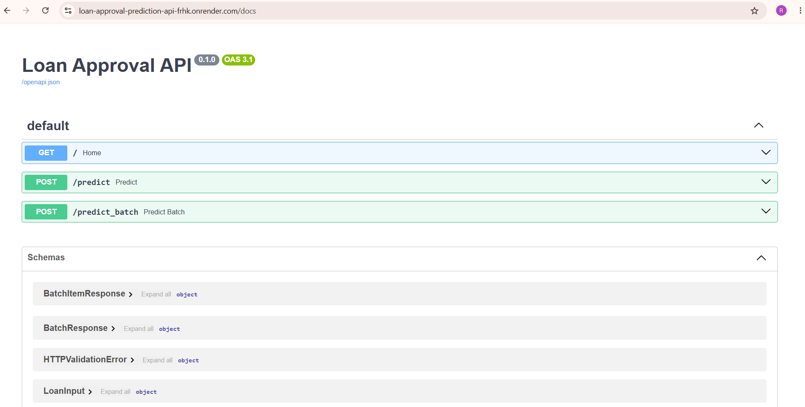
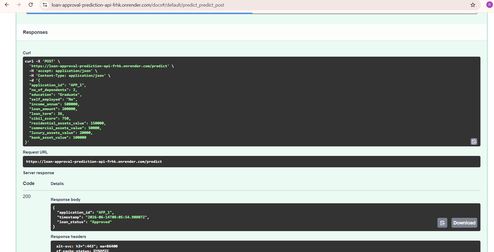

# 🏦 Loan Approval Prediction API

A production-ready Machine Learning API built with **FastAPI**, **Scikit-learn**, **SQLite**, and **Docker** for predicting loan approval decisions based on applicant information.

The system provides both single and batch prediction endpoints, validates incoming requests using Pydantic, stores prediction history in a SQLite database, and supports containerized deployment with automated CI/CD.

---

# 🚀 Features

* 🤖 Loan approval prediction using a trained Random Forest model
* ⚡ FastAPI REST API with automatic Swagger documentation
* 📦 Single prediction endpoint
* 📦 Batch prediction endpoint with partial success handling
* ✅ Input validation using Pydantic
* 🗄️ SQLite database for prediction history
* 🐳 Docker containerization
* 🔄 GitHub Actions Continuous Integration (CI)
* 🚀 Automatic deployment to Render using GitHub Actions (CD)

---

# 🏗️ Tech Stack

**Backend:** FastAPI

**Machine Learning:** Scikit-learn (Random Forest)

**Database:** SQLite

**Validation:** Pydantic

**Containerization:** Docker

**CI/CD:** GitHub Actions + Render

**Model Serialization:** Joblib

**Server:** Uvicorn

---

# 📁 Project Structure

```text
Loan/
│
├── src/
│   ├── app.py
│   ├── database.py
│   ├── schemas.py
│   ├── loan_preprocessor.py
│   ├── final_loan_model.pkl
│   └── database.db
│
├── notebooks/
├── Dockerfile
├── requirements.txt
├── .dockerignore
├── .github/
│   └── workflows/
│       ├── CI.yaml
│       └── CD.yaml
│
└── README.md
```

---

# ⚙️ System Workflow

1. Client sends a prediction request.
2. FastAPI validates the request using Pydantic.
3. The preprocessing pipeline prepares the input features.
4. The trained Random Forest model predicts the loan status.
5. The prediction is stored in the SQLite database.
6. The prediction result is returned to the client.

---

# 📡 API Endpoints

## 🔹 Health Check

```http
GET /
```

Response

```json
{
  "message": "Loan Approval API Running"
}
```

---

## 🔹 Predict Loan Approval

```http
POST /predict
```

Returns

* application_id
* timestamp
* loan_status

---

## 🔹 Batch Prediction

```http
POST /predict_batch
```

Features

* Batch inference
* Partial success handling
* Request validation
* SQLite logging
* Error reporting per record

---

# 📸 API Demo & Screenshots

The API was tested through Swagger UI using different loan application examples.

## 🔹 Swagger UI



---

## 🔹 Loan Prediction Example 1



---

## 🔹 Loan Prediction Example 2


---

# 🗄️ Database

The application stores every prediction in a SQLite database.

Stored fields:

* application_id
* timestamp
* loan_status

---

# 🧪 Running Locally

## Install dependencies

```bash
pip install -r requirements.txt
```

## Start the API

```bash
uvicorn src.app:app --reload
```

Open Swagger UI:

```
http://127.0.0.1:8000/docs
```

---

# 🐳 Docker

## Build Docker image

```bash
docker build -t loan-api .
```

## Run container

```bash
docker run -p 8000:8000 loan-api
```

## Run with persistent SQLite database

```bash
docker run -p 8000:8000 -v %cd%\src:/app/src loan-api
```

---

# 🔄 Continuous Integration & Deployment

This project uses **GitHub Actions** to automate testing and deployment.

### Continuous Integration (CI)

The CI workflow automatically:

* Builds the Docker image
* Starts the application container
* Performs an API health check

### Continuous Deployment (CD)

After a successful CI run:

* GitHub Actions automatically triggers a Render Deploy Hook.
* Render deploys the latest version of the application.

---

# 🚀 Deployment

The application is deployed on **Render**.

### Live API

https://loan-approval-prediction-api-frhk.onrender.com

### Swagger Documentation

https://loan-approval-prediction-api-frhk.onrender.com/docs

---

# 🔗 Project Links

**GitHub Repository**

https://github.com/rehabalsayed/loan-approval-prediction-api

**Live API**

https://loan-approval-prediction-api-frhk.onrender.com

**Swagger UI**

https://loan-approval-prediction-api-frhk.onrender.com/docs

---

# 📌 Future Improvements

* PostgreSQL integration
* Authentication using JWT
* Unit and integration testing
* Monitoring and logging
* Kubernetes deployment

---

# 👩‍💻 Author

**Rehab Alsayed**

Machine Learning Engineer

Passionate about Machine Learning, MLOps, and Production AI Systems.
